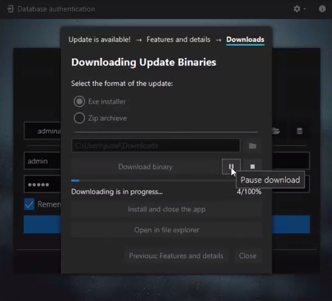

jfxtras-styles
==============

JavaFX themes / styles that can be used to give applications a different look and feel.


## JMetro
**_<ins>[Also check out [Transit Theme](https://pixelduke.com/transit-java-javafx-theme) another theme I've created that builds upon lessons
learned while developing JMetro]</ins>_**
  
.png)

### Documentation 
Documentation of JMetro can be found in this link: [JMetro Java, Javafx theme documentation](https://pixelduke.com/java-javafx-theme-jmetro).  

### Strengths and Key Principles
* Modern look and feel
* Zero tight coupling with this library:
    * No new controls. Functionality is added "behind the curtains" to existing JavaFX controls through the Skin API
    * Setting and unsetting is seamless and easy (only 1 line of code) even on already existing apps that don't use this theme
* Looks integrated on Windows (80%/90% of desktop users use Windows) also works well on other OSes
* Light and Dark versions;
* Easily override and customize colors by overriding JavaFX CSS variables
* Only relies on JavaFX CSS, JavaFX API and Java code (no other "foreign" technologies)
* Samples and theme tester app on samples sub-project
* Lots of real world, recognized Java apps already using it (NASA's applications, applications used in the White House, etc, etc)

This is a “pluggable” JavaFX theme.   
This means there’s zero coupling because this theme doesn’t define any new Controls and the developer only needs to run 1 line of
code to set the theme (this is all the coupling you’ll get).  
It adds features to the existing JavaFX controls that you regularly use (controls from the standard JavaFX API or from known third
party libraries) by leveraging the JavaFX Skin API. 

Check [documentation](https://pixelduke.com/java-javafx-theme-jmetro) for a deeper dive.

### Getting JMetro
You can get the jar from Maven Central or download it from the [releases tab](https://github.com/JFXtras/jfxtras-styles/releases)  

Here are examples for Gradle and Maven (replace version number with the version you want):

#### Gradle
```groovy
implementation 'org.jfxtras:jmetro:11.6.15'
```

#### Maven
```xml
<dependency>
    <groupId>org.jfxtras</groupId>
    <artifactId>jmetro</artifactId>
    <version>11.6.15</version>
</dependency>
```

### Source code
We have two important branches:

* **master** -> JavaFX 11 and above / Java 11 and above (actively developed branch)
* **jdk-8** -> JavaFX 8 / Java 8 (maintenance mode, no active development is ongoing) 

The master branch is being tested using JavaFX 11.

The jmetro-samples subproject has samples that you can run and also check out how to use JMetro.

### Java 8 version
The "jdk-8" branch has the code for versions 8 of JMetro which are meant to run with Java 8. It is in maintenance mode, 
no active development is ongoing. If you want me to add features or make backports from the "master" branch please consider
sponsoring those changes.

### Pull Requests (PR)
We welcome contributions via PR.  
Before submitting a PR, please file an issue for prior discussion. This will avoid you wasting time with a PR that
might not be approved because, for instance, it might be outside the intended scope of the project.

### Filing bugs
When filing bugs it's most often good practice to attach a small sample app (as small, simple and with the fewest lines of code as possible). This app when executed, should show the bug happening.  
The reason for this is the limited amount of resources and time I have and also because in the process of filing a bug, developers sometimes discover that the bug isn't in the library but somewhere else.   
Without a small example app the issue might be closed prematurely.  

### Feedback request
Please show pictures of your application that is using JMetro or share it through social media. This is very important for us
to know how users are effectively using it and make adjustments accordingly, to make JMetro better, and, only if you allow it, to showcase example uses.    
Seeing JMetro being used is also always a source of motivation to keep working on it.

## License
JFXtras uses the [new BSD](http://en.wikipedia.org/wiki/BSD_licenses#3-clause_license_.28.22Revised_BSD_License.22.2C_.22New_BSD_License.22.2C_or_.22Modified_BSD_License.22.29) license

